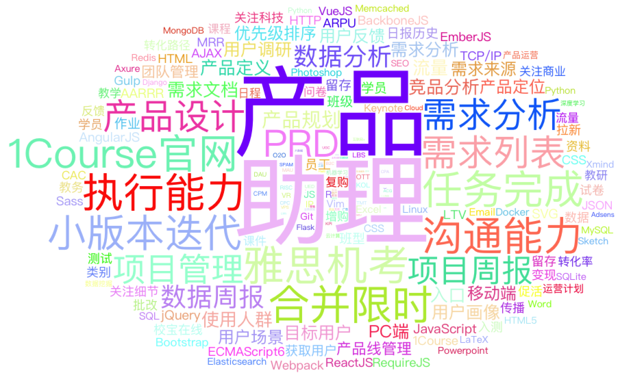

# 产品经理的词云
该项目是产品经理日常工作的一些关键词，
利用R的wordcloud2包，生成词云。
## 目前包含的关键词列表 
### PM基本学习

* 产品经理能力模型1-9 pm_level[1--9]
* 做产品经理最好具备的一些特质 pm_property
* PM应该学习的软件 pm_software
* PM日常关键词 pm\_daily\_keywords 
* 产品经理推荐书籍
* 产品经理经典人物

### 互联网相关

* 互联网关键词 internet_keywords
* 商业模式关键词
* 互联网12大领域 pm_field
* 前沿技术关键词
* 热门创业领域？

### 上下游岗位
#### 开发岗位
* 前端开发关键词 web_dev
* 服务器开发关键词 server_dev
* 数据存储 data
* 开发工具 dev_tools

#### 设计岗位
* UED日常关键词 待添加

#### 运营岗位
* 产品运营关键词
* 运营日常关键词 po_keywords

### 工作相关
* 在校宝在线做的项目列表 xiaobao_word
* 校宝企业关键词 xiaobao_keywords
* 1Course产品关键词 xiaobao_1Course

## Preview
